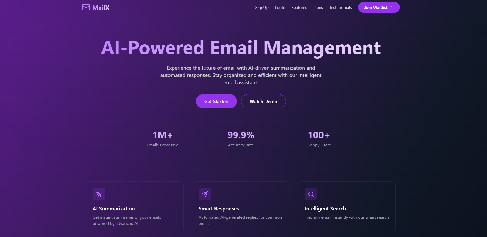
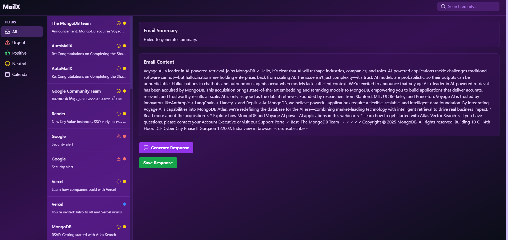

# 📩 **MailX**  

## **Short Description**  
MailX is an **AI-powered email management system** that helps users efficiently organize, prioritize, and respond to emails with smart automation features.  

---

## **Are You Solving a Real-World Problem?** ✅  

### **Problem**  
Managing emails can be overwhelming, with important messages often buried under spam or low-priority emails.  
People spend hours sorting, reading, and replying to emails, which affects productivity.  
Without an intelligent system to categorize and manage emails effectively, users struggle to maintain an organized inbox.  

### **Solution**  
MailX leverages **AI** to streamline email management:  
- ✅ Automatically categorizes emails  
- ✅ Highlights priority messages  
- ✅ Provides AI-generated insights and responses  

This allows users to stay organized, save time, and focus on what matters most.  

---

## **Tech Stack Used**  
🔹 **Backend:** Node.js, Express.js, Passport.js (Google Authentication)  
🔹 **Frontend:** React, Tailwind CSS  
🔹 **Database:** MongoDB  

---

## **Key Features**  
✔ **Smart Inbox:** Automatically organizes emails based on priority  
✔ **Priority Emails:** Identifies and highlights important messages  
✔ **AI Insights:** Provides smart suggestions and auto-generated responses  

---

## **What Kind of AI Model Are You Using?**  
- 🏷 **Classification**  
- ✍ **Generation**  
- 🔍 **Extraction**  

---

## **Screenshots**  

| **Dashboard** | **AI Insights** |
|--------------|---------------|
|  |  |

---

## **Team Members**  
👥 **L.Kiran Teja**  
👥 **Aswin Kumar Reddy**  
👥 **Srinivas Thanniru**  


---

## 📁 **Project Structure**

```
MailX/
├── client/                 # React frontend application
│   ├── src/
│   │   ├── Components/     # Reusable React components
│   │   ├── Pages/          # Application pages
│   │   ├── App.tsx         # Main application component
│   │   └── main.tsx        # Application entry point
│   ├── public/             # Static assets
│   ├── package.json        # Frontend dependencies
│   └── vite.config.ts      # Vite configuration
├── server/                 # Node.js backend application
│   ├── models/             # MongoDB data models
│   ├── routes.js           # API routes
│   ├── server.js           # Main server file
│   └── package.json        # Backend dependencies
├── .env                    # Environment variables
├── .gitignore              # Git ignore rules
├── README.md               # Project documentation
└── package.json            # Root dependencies
```

---

## 🚀 **How to Run MailX Locally**  

Follow these steps to set up and run the *MailX* project on your local system.  

### 📥 **Step 1: Clone the Repository**  

```bash
 git clone https://github.com/KiranTejz20005/Mail_X.git
 cd MailX
```

---

### ⚙ **Step 2: Install Dependencies**  

Navigate to the **backend directory** and install dependencies:  

```bash
cd server
npm install
```

Navigate to the **frontend directory** and install dependencies:  

```bash
cd ../client
npm install
```

---

### ▶ **Step 3: Run the Frontend and Backend Servers**  

1️⃣ **Run the Backend Server:**  

```bash
cd ../server
npm start
```

2️⃣ **Run the Frontend Server:**  

```bash
cd ../client
npm start
```

---

### 🌐 **Step 4: Access the Application**  

- **Frontend:** Open your browser and go to:  
  🔗 [http://localhost:5173](http://localhost:5173)  

- **Backend API:** Accessible at:  
  🔗 [http://localhost:5000](http://localhost:5000) (or the configured port)  

---

### 🐞 **Troubleshooting**  

- Ensure all dependencies are correctly installed.  
- Check if the ports are not in conflict with other running services.  
- Review terminal logs for any errors.  

You're all set to use **MailX** locally! 🚀  

---

## 🌍 **Live Application**  
- **Frontend**: [MailX Frontend](https://mail-x.vercel.app/)
- **Backend:** [MailX Backend](https://automailx-sm-52mt.onrender.com/)
- **Repository**: [GitHub Repository](https://github.com/KiranTejz20005/Mail_X.git)
 

---


## 📊 **Presentation**  
📜 [MailX PPT](https://www.canva.com/design/DAG1i7DF4ds/bDUwkf3tz1xyCVgj5K_TMw/edit?utm_content=DAG1i7DF4ds&utm_campaign=designshare&utm_medium=link2&utm_source=sharebutton)  

---

## 📞 **Support**

For support, email support@mailx.com or join our Slack channel.

---


**Made with ❤️ by the MailX Team**
